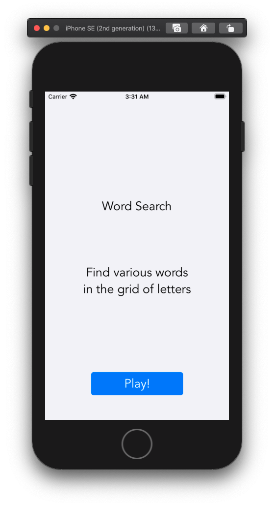
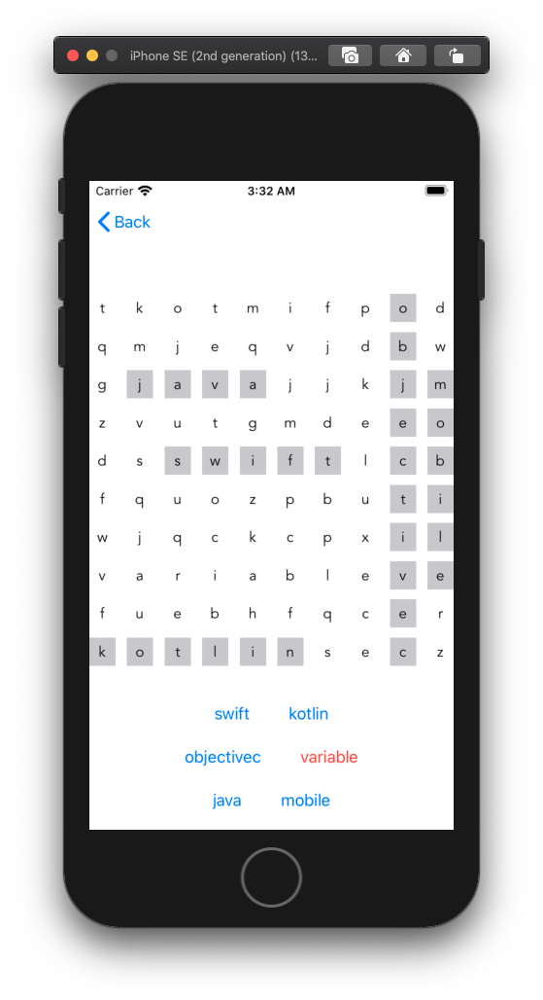

# Word Search project built for Shopify Winter 2021 Internship Application

# Features

The words are randomly placed in the grid with each new game

The user must tap on each individual letter in order to find the word

When all words are found the user is presented with a new view saying congratulations and prompting the user to play again

